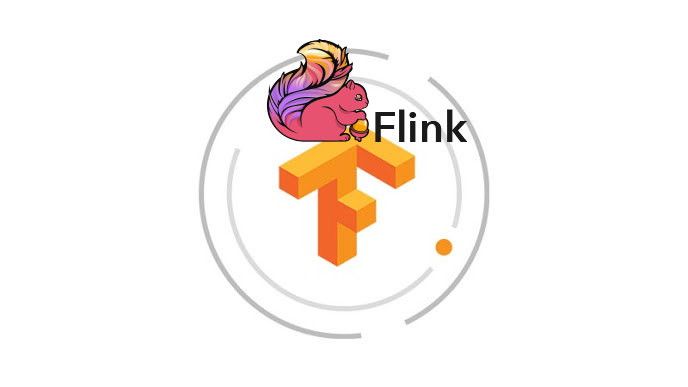

# Tensorflow on Flink


## Basic Conceptions

It's hard to use Tensorflow in standard JVM,
because the Tensorflow on JVM need native libraries and so many other dependencies.
But there's another way to apply your Tensorflow model on JVM: Use Tensorflow.js and V8 engine.

The V8 engine we're using is based on some native library.
But in future releases of Java, the Nashorn engine will support ES6.
We will use nashorn instead of V8.

## Features

- Realtime machine learning (prediction)
- Update your model without restart your streaming computation system
- Not only models, but pre-processing and conversion of the data.

## Tutorial

For contributing an example of TF.js on Flink,
we use [WINE](https://archive.ics.uci.edu/ml/datasets/wine) dataset to build our model and realtime predict system.

### Step 1: Build your model by Keras

By using [WINE](https://archive.ics.uci.edu/ml/datasets/wine) dataset, we build a really simple model.

This model is only for EXAMPLE!

See [model](model/ModelExample.ipynb) for more details about model contribution.

We saved the model by:
```python
import tensorflowjs as tfjs
tfjs.converters.save_keras_model(model, "model")
```

You can also done this step by command line tool.

### Step 2: Convert you model into executable javascript library

First, We upload the model to our website (shinonome.com) for tensorflow.js to load it.

Switch your dir into `model` and:

1. Modify `src/generate_app.js`, change the variable `modelPath` into the path of your model.
2. Run the commands below:
```bash
npm run build # if you want to build more readable script, try npm run build-dev
```

After compile stage, we get `ml.bundle.js` in `model/target`, and that's our model~

### Step 3: Write appropriate `IModel` for your input type and return type

We're using DenseMatrix to pass the data and result,
if there're more personal requirement like pre-processing,
you may edit the function `predict` in `src/app_template.js` and rebuild it.
And you may write your own `IModel` to adapt your personal data type.

### Step 5: Apply your model in the Flink

Add a rich map function in your streaming computation DAG maybe the most simple way to apply your predict model like the example shows.

If there's no requirement to change the model while running, you can easily put them in `resources` and load them.

### Step 6: Build your update pipeline if necessary

There're quite many ways to update your model on~the~fly~~

- Push your models into Kafka, receive them in Kafka and connect data stream and model stream.
- Put your model and version file on some file server, check version periodically and reload model while the version change.
- Some other methods like `Spring Cloud Config Server`

If you can read Chinese, read [this artical](https://zhuanlan.zhihu.com/p/52007980) written by me.
